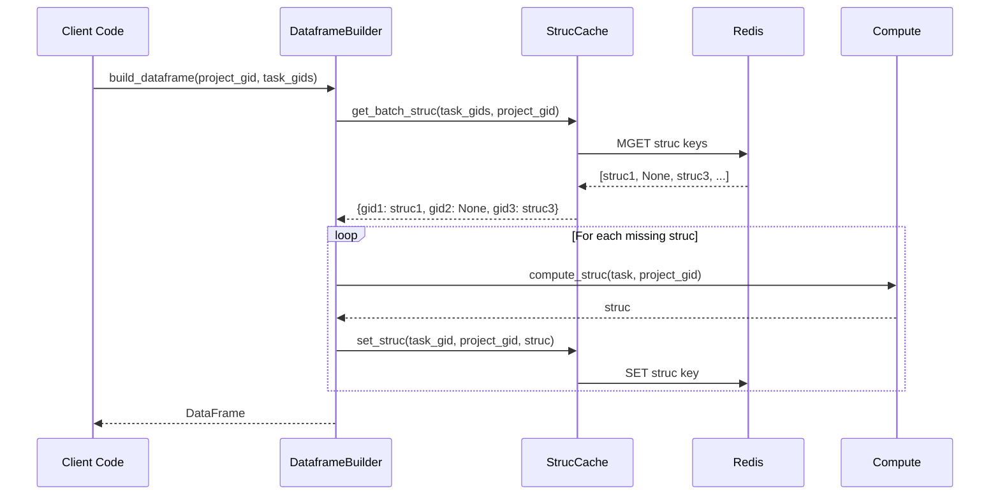

# ADR-0021: Dataframe Caching Strategy

## Metadata
- **Status**: Accepted
- **Author**: Architect
- **Date**: 2025-12-09
- **Deciders**: Architect, Principal Engineer, autom8 team, User
- **Related**: [PRD-0002](../requirements/PRD-0002-intelligent-caching.md), [TDD-0008](../design/TDD-0008-intelligent-caching.md)

## Context

The autom8_asana SDK computes "struc" (structural data) for tasks, which is used to build dataframes for reporting and analysis. Struc computation involves:

1. Fetching task data
2. Resolving custom field values based on project context
3. Computing derived fields (status, priority mappings, etc.)
4. Formatting for dataframe consumption

**Problem**: The same task can have different struc output depending on which project it belongs to, because:
- Projects have different custom field configurations
- Custom field option values vary by project
- Some computed fields depend on project-specific logic

**Example**:
- Task T1 is multi-homed in Project A and Project B
- Project A has custom field "Priority" with options: High, Medium, Low
- Project B has custom field "Priority" with options: P0, P1, P2
- Task T1's struc for Project A differs from its struc for Project B

**Requirements**:
- FR-CACHE-027: Cache STRUC entries with project context in key
- FR-CACHE-051: Cache computed struc per task+project
- FR-CACHE-052: Invalidate struc when task is modified

**User decision**: Struc cache key must include project context: `struc:{task_gid}:{project_gid}`

## Decision

**Cache struc data per task+project combination, using composite key `asana:struc:{task_gid}:{project_gid}`, and invalidate on task `modified_at` change.**

### Key Structure

```
# Struc with project context
asana:struc:{task_gid}:{project_gid}
    data: {
        "gid": "1234567890",
        "name": "Task Name",
        "priority": "High",           # Project-A-specific
        "status": "In Progress",
        "custom_field_values": {...}, # Project-specific mappings
        ...
    }
    version: <task modified_at>
    cached_at: <computation timestamp>
    ttl: <TTL in seconds>
```

### Implementation

```python
class StrucCache:
    """Struc caching with project context."""

    def get_struc(
        self,
        task_gid: str,
        project_gid: str,
    ) -> dict | None:
        """Get cached struc for task in project context."""
        key = f"struc:{task_gid}:{project_gid}"
        entry = self._cache.get_versioned(key, EntryType.STRUC)
        return entry.data if entry else None

    def set_struc(
        self,
        task_gid: str,
        project_gid: str,
        struc: dict,
        task_modified_at: datetime,
    ) -> None:
        """Cache struc for task in project context."""
        key = f"struc:{task_gid}:{project_gid}"
        entry = CacheEntry(
            data=struc,
            entry_type=EntryType.STRUC,
            version=task_modified_at,
            cached_at=datetime.utcnow(),
            ttl=self._settings.ttl.get_ttl(
                project_gid=project_gid,
                entry_type="struc",
            ),
        )
        self._cache.set_versioned(key, entry)

    def invalidate_task_struc(
        self,
        task_gid: str,
        project_gids: list[str] | None = None,
    ) -> None:
        """Invalidate struc for task across projects.

        Args:
            task_gid: Task whose struc to invalidate
            project_gids: Specific projects to invalidate, or None for all
        """
        if project_gids:
            for project_gid in project_gids:
                key = f"struc:{task_gid}:{project_gid}"
                self._cache.delete(key)
        else:
            # Pattern delete: asana:struc:{task_gid}:*
            pattern = f"struc:{task_gid}:*"
            self._cache.delete_pattern(pattern)

    async def get_batch_struc(
        self,
        task_gids: list[str],
        project_gid: str,
    ) -> dict[str, dict | None]:
        """Get cached struc for multiple tasks in same project."""
        keys = [f"struc:{gid}:{project_gid}" for gid in task_gids]
        entries = await self._cache.get_batch(keys, EntryType.STRUC)
        return {
            gid: entries.get(f"struc:{gid}:{project_gid}", {}).data
            if entries.get(f"struc:{gid}:{project_gid}")
            else None
            for gid in task_gids
        }
```

### Invalidation Rules

| Event | Invalidation Action |
|-------|---------------------|
| Task `modified_at` changed | Invalidate all struc entries for task (all projects) |
| Project custom fields changed | Invalidate all struc entries for project (all tasks) |
| Task moved between projects | Invalidate struc for both old and new project |
| Task removed from project | Invalidate struc for that project |

### Struc Computation Flow



## Rationale

**Why include project_gid in cache key?**

A task's struc depends on project context:

```python
# Same task, different projects
struc_project_a = {
    "gid": "123",
    "name": "Fix bug",
    "priority": "High",       # From Project A's custom field
    "sprint": "Sprint 42",    # Only exists in Project A
}

struc_project_b = {
    "gid": "123",
    "name": "Fix bug",
    "priority": "P0",         # From Project B's custom field (different options)
    # No "sprint" field in Project B
}
```

Caching without project context would serve wrong data when task is multi-homed.

**Why use task `modified_at` as version?**

Struc is derived from task data. When task data changes (`modified_at` updates), cached struc is stale. Using task's `modified_at` as struc version allows:
- Simple staleness detection (compare with current task `modified_at`)
- Consistent with other entry types' versioning
- No need for separate struc version tracking

**Why pattern delete for full task invalidation?**

When a task is modified, its struc is stale in ALL projects. Rather than tracking which projects a task belongs to:
- Use Redis `SCAN` + `DEL` for pattern `struc:{task_gid}:*`
- Simpler than maintaining task-to-project mapping
- Slightly slower but rare operation (only on invalidation)

## Alternatives Considered

### Alternative 1: Task-Only Cache Key

- **Description**: Cache struc with key `struc:{task_gid}`, ignore project context.
- **Pros**:
  - Simpler key structure
  - Fewer cache entries
  - Single struc per task
- **Cons**:
  - Wrong data for multi-homed tasks
  - Custom field values incorrect for different projects
  - User explicitly rejected this approach
- **Why not chosen**: User decision. Tasks in multiple projects have different struc output.

### Alternative 2: Store All Project Strucs Together

- **Description**: Cache `struc:{task_gid}` containing dict of `{project_gid: struc}`.
- **Pros**:
  - Single key per task
  - All project strucs together
  - Atomic updates
- **Cons**:
  - Large cache entries for multi-homed tasks
  - Can't set per-project TTLs
  - Full entry rewrite on any project change
  - Complex merge logic
- **Why not chosen**: Violates per-project TTL requirements (FR-CACHE-061). Inefficient for selective access.

### Alternative 3: No Struc Caching

- **Description**: Compute struc on-demand, don't cache.
- **Pros**:
  - Always current
  - No cache consistency concerns
  - Simpler architecture
- **Cons**:
  - Repeated computation for same data
  - Slow dataframe builds
  - Wastes CPU on unchanged tasks
- **Why not chosen**: Struc computation is expensive. Caching provides significant performance benefit for dataframe builds.

### Alternative 4: Separate Struc Version Field

- **Description**: Track struc version independently from task `modified_at`.
- **Pros**:
  - Could detect struc-specific changes
  - Finer-grained invalidation
- **Cons**:
  - No reliable way to determine "struc changed"
  - Additional complexity
  - Task `modified_at` covers all relevant changes
- **Why not chosen**: Struc is derived from task data. Task `modified_at` is sufficient indicator.

### Alternative 5: Project-First Key Structure

- **Description**: Use key `struc:{project_gid}:{task_gid}` instead.
- **Pros**:
  - Groups all tasks in a project together
  - Easier project-level operations
  - Natural for "get all struc for project" queries
- **Cons**:
  - Task-level invalidation requires scanning by pattern
  - Task changes are more common than project changes
  - Optimization for wrong access pattern
- **Why not chosen**: Task-first key structure (`struc:{task_gid}:{project_gid}`) matches primary access pattern (task-centric operations).

## Consequences

### Positive

- **Correct multi-homed task handling**: Different struc per project context
- **Efficient dataframe builds**: Batch struc retrieval
- **Simple staleness detection**: Uses task `modified_at` consistently
- **Per-project TTL support**: Different TTLs for different projects
- **Selective invalidation**: Can invalidate specific task+project combinations

### Negative

- **More cache entries**: N projects per task = N cache entries
- **Pattern delete complexity**: Full task invalidation requires pattern scan
- **Project change impact**: Project custom field changes invalidate many entries
- **Storage overhead**: Storing struc per-project instead of per-task

### Neutral

- **Cache key format**: `asana:struc:{task_gid}:{project_gid}` is explicit and scannable
- **Version tied to task**: Struc version = task `modified_at`
- **Batch operations work per-project**: Natural for dataframe building

## Compliance

To ensure this decision is followed:

1. **Code review checklist**:
   - Struc cache keys include project_gid
   - Struc invalidation handles multi-project scenarios
   - Batch struc operations specify project context

2. **Testing requirements**:
   - Unit tests for multi-homed task caching
   - Unit tests for project-specific struc differences
   - Integration tests for invalidation across projects

3. **Documentation**:
   - Explain project context requirement in API docs
   - Document invalidation behavior for multi-homed tasks
   - Clarify project custom field change impact

4. **Metrics**:
   - Track struc cache hit rate per project
   - Monitor struc computation time (cached vs uncached)
   - Alert on high struc cache miss rates
