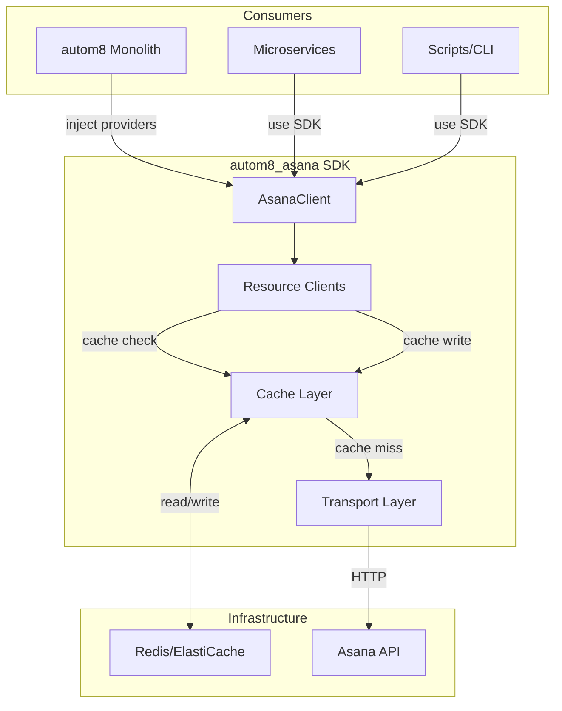
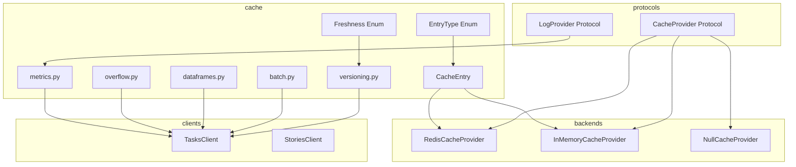
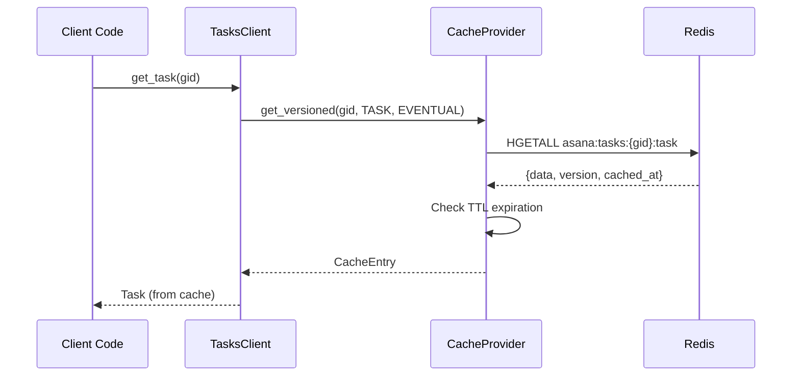
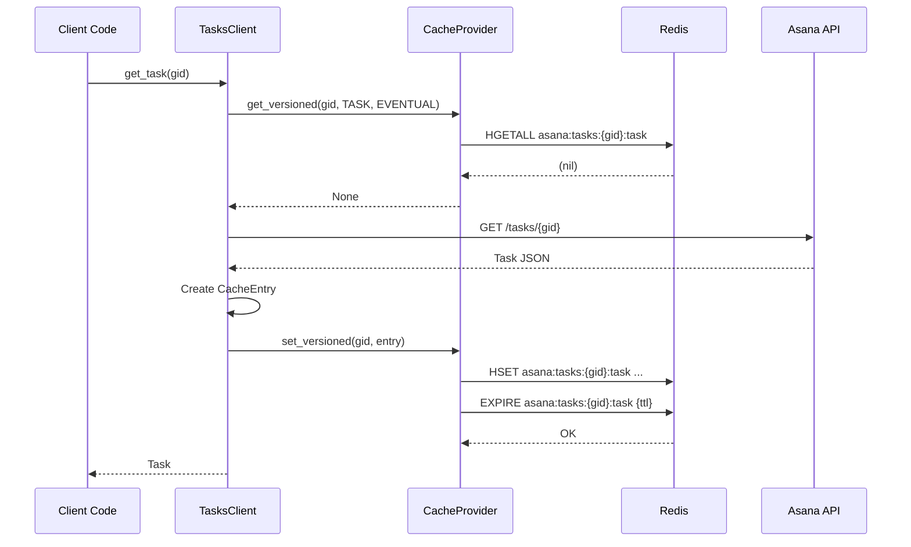
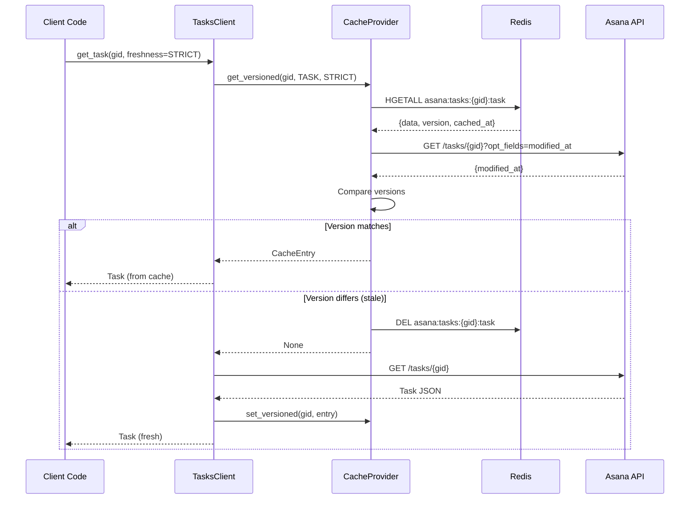
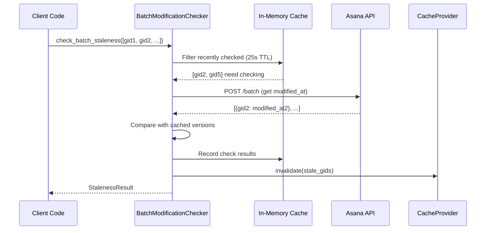
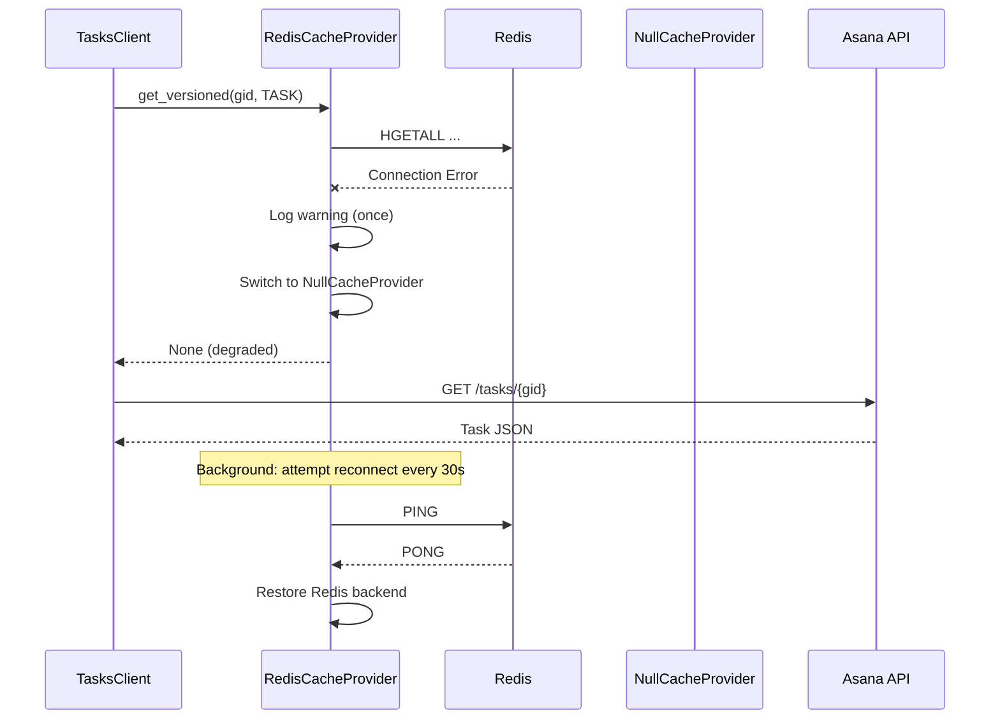

# TDD: Intelligent Caching Layer

## Metadata
- **TDD ID**: TDD-0008
- **Status**: Draft
- **Author**: Architect
- **Created**: 2025-12-09
- **Last Updated**: 2025-12-09
- **PRD Reference**: [PRD-0002](../requirements/PRD-0002-intelligent-caching.md)
- **Related TDDs**:
  - [TDD-0001](TDD-0001-sdk-architecture.md) - SDK Architecture (foundation)
  - [TDD-0007](TDD-0007-observability.md) - Observability (LogProvider extension)
- **Related ADRs**:
  - [ADR-0001](../decisions/ADR-0001-protocol-extensibility.md) - Protocol-based extensibility
  - [ADR-0016](../decisions/ADR-0016-cache-protocol-extension.md) - Cache protocol extension
  - [ADR-0017](../decisions/ADR-0017-redis-backend-architecture.md) - Redis backend architecture
  - [ADR-0018](../decisions/ADR-0018-batch-modification-checking.md) - Batch modification checking
  - [ADR-0019](../decisions/ADR-0019-staleness-detection-algorithm.md) - Staleness detection algorithm
  - [ADR-0020](../decisions/ADR-0020-incremental-story-loading.md) - Incremental story loading
  - [ADR-0021](../decisions/ADR-0021-dataframe-caching-strategy.md) - Dataframe caching strategy
  - [ADR-0022](../decisions/ADR-0022-overflow-management.md) - Overflow management
  - [ADR-0023](../decisions/ADR-0023-observability-strategy.md) - Observability strategy
  - [ADR-0024](../decisions/ADR-0024-thread-safety-guarantees.md) - Thread-safety guarantees
  - [ADR-0025](../decisions/ADR-0025-migration-strategy.md) - Big-bang migration strategy

## Overview

This design extends the autom8_asana SDK's basic `CacheProvider` protocol with versioned entries, multi-entry caching, batch modification checking, and Redis backend support. The architecture maintains backward compatibility with existing consumers while enabling intelligent cache invalidation through `modified_at` versioning, configurable per-project TTLs, and overflow management. Redis is the sole production backend (breaking change from legacy S3), with observability delivered through an extended `LogProvider` protocol.

## Requirements Summary

This design addresses [PRD-0002](../requirements/PRD-0002-intelligent-caching.md), which defines:

- **100 functional requirements** across protocol extension (FR-CACHE-001-010), Redis backend (FR-CACHE-011-020), multi-entry caching (FR-CACHE-021-030), batch modification checking (FR-CACHE-031-040), incremental loading (FR-CACHE-041-050), dataframe caching (FR-CACHE-051-060), TTL configuration (FR-CACHE-061-070), overflow management (FR-CACHE-071-080), observability (FR-CACHE-081-090), and graceful degradation (FR-CACHE-091-100)
- **40 non-functional requirements** covering performance (NFR-PERF-001-010), reliability (NFR-REL-001-010), compatibility (NFR-COMPAT-001-010), and security (NFR-SEC-001-010)
- **Key constraint**: Redis-only backend (S3 dropped), big-bang migration (no dual-read)

## System Context

The Intelligent Caching Layer sits between the SDK's resource clients and the Asana API, intercepting read operations to serve from cache when fresh and writing responses back to cache after API calls.



### Integration Points

| Integration Point | Protocol | autom8 Implementation | Standalone Default |
|-------------------|----------|----------------------|-------------------|
| Caching | Extended `CacheProvider` | `RedisCacheProvider` | `NullCacheProvider` |
| Cache Events | Extended `LogProvider` | CloudWatch via callback | Stdout/no-op |
| Configuration | `CacheSettings` | Loaded from config service | Environment/defaults |

## Design

### Component Architecture



| Component | Responsibility | Location |
|-----------|---------------|----------|
| `CacheProvider` | Extended protocol with versioned operations | `protocols/cache.py` |
| `LogProvider` | Extended protocol with `log_cache_event()` | `protocols/log.py` |
| `CacheEntry` | Dataclass holding cached data with metadata | `cache/entry.py` |
| `EntryType` | Enum defining 7 cache entry types | `cache/entry.py` |
| `Freshness` | Enum for strict vs eventual consistency | `cache/freshness.py` |
| `RedisCacheProvider` | Redis backend implementation | `cache/backends/redis.py` |
| `InMemoryCacheProvider` | Enhanced in-memory cache | `cache/backends/memory.py` |
| `versioning` | Staleness detection and version comparison | `cache/versioning.py` |
| `batch` | Batch modification checking with TTL | `cache/batch.py` |
| `dataframes` | Struc caching logic | `cache/dataframes.py` |
| `overflow` | Overflow threshold management | `cache/overflow.py` |
| `metrics` | CacheMetrics and event aggregation | `cache/metrics.py` |

### Package Structure

```
src/autom8_asana/
├── protocols/
│   ├── cache.py              # Extended CacheProvider protocol
│   └── log.py                # Extended LogProvider with log_cache_event
├── _defaults/
│   └── cache.py              # Updated NullCacheProvider, InMemoryCacheProvider
├── cache/
│   ├── __init__.py           # Public exports
│   ├── entry.py              # CacheEntry dataclass, EntryType enum
│   ├── freshness.py          # Freshness enum (strict, eventual)
│   ├── settings.py           # CacheSettings, OverflowSettings, TTLSettings
│   ├── backends/
│   │   ├── __init__.py
│   │   ├── redis.py          # RedisCacheProvider
│   │   └── memory.py         # Enhanced InMemoryCacheProvider
│   ├── versioning.py         # Version comparison, staleness detection
│   ├── batch.py              # Batch modification checking with 25s TTL
│   ├── dataframes.py         # Struc caching logic
│   ├── overflow.py           # Overflow threshold management
│   └── metrics.py            # CacheMetrics, event logging
└── clients/
    └── tasks.py              # Integrate caching into TasksClient
```

### Data Model

#### CacheEntry Dataclass

```python
from dataclasses import dataclass, field
from datetime import datetime
from enum import Enum
from typing import Any


class EntryType(Enum):
    """Types of cache entries with distinct versioning strategies."""
    TASK = "task"
    SUBTASKS = "subtasks"
    DEPENDENCIES = "dependencies"
    DEPENDENTS = "dependents"
    STORIES = "stories"
    ATTACHMENTS = "attachments"
    STRUC = "struc"


class Freshness(Enum):
    """Cache freshness modes."""
    STRICT = "strict"      # Validate version before returning
    EVENTUAL = "eventual"  # Return cached without validation


@dataclass(frozen=True)
class CacheEntry:
    """Immutable cache entry with versioning metadata.

    Attributes:
        data: The cached payload (task dict, list of subtasks, etc.)
        entry_type: Type of entry for versioning strategy selection
        version: The modified_at timestamp for staleness comparison
        cached_at: When this entry was written to cache
        ttl: Time-to-live in seconds, None for no expiration
        metadata: Additional entry-type-specific metadata
    """
    data: dict[str, Any]
    entry_type: EntryType
    version: datetime
    cached_at: datetime
    ttl: int | None = None
    metadata: dict[str, Any] = field(default_factory=dict)

    def is_expired(self, now: datetime | None = None) -> bool:
        """Check if entry has exceeded its TTL."""
        if self.ttl is None:
            return False
        now = now or datetime.utcnow()
        elapsed = (now - self.cached_at).total_seconds()
        return elapsed > self.ttl

    def is_stale(self, current_version: datetime) -> bool:
        """Check if entry is stale compared to current version."""
        return current_version > self.version
```

#### CacheSettings Configuration

```python
from dataclasses import dataclass, field
from typing import Any


@dataclass
class OverflowSettings:
    """Per-relationship overflow thresholds."""
    subtasks: int = 40
    dependencies: int = 40
    dependents: int = 40
    stories: int = 100
    attachments: int = 40


@dataclass
class TTLSettings:
    """TTL configuration with per-project and per-entry-type overrides."""
    default_ttl: int = 300  # 5 minutes
    project_ttls: dict[str, int] = field(default_factory=dict)
    entry_type_ttls: dict[str, int] = field(default_factory=dict)

    def get_ttl(
        self,
        project_gid: str | None = None,
        entry_type: str | None = None
    ) -> int:
        """Resolve TTL with priority: project > entry_type > default."""
        if project_gid and project_gid in self.project_ttls:
            return self.project_ttls[project_gid]
        if entry_type and entry_type in self.entry_type_ttls:
            return self.entry_type_ttls[entry_type]
        return self.default_ttl


@dataclass
class CacheSettings:
    """Complete cache configuration."""
    enabled: bool = True
    ttl: TTLSettings = field(default_factory=TTLSettings)
    overflow: OverflowSettings = field(default_factory=OverflowSettings)
    batch_check_ttl: int = 25  # seconds for in-memory batch check cache
    reconnect_interval: int = 30  # seconds between Redis reconnect attempts
    max_batch_size: int = 100  # max GIDs per batch modification check
```

#### CacheMetrics Aggregator

```python
from dataclasses import dataclass, field
from datetime import datetime
from threading import Lock
from typing import Callable


@dataclass
class CacheEvent:
    """Individual cache event for logging."""
    event_type: str  # hit, miss, write, evict, expire, error
    key: str
    entry_type: str | None
    latency_ms: float
    timestamp: datetime
    correlation_id: str | None = None
    metadata: dict = field(default_factory=dict)


class CacheMetrics:
    """Thread-safe cache metrics aggregator."""

    def __init__(self) -> None:
        self._lock = Lock()
        self._hits = 0
        self._misses = 0
        self._writes = 0
        self._evictions = 0
        self._errors = 0
        self._total_latency_ms = 0.0
        self._overflow_skips: dict[str, int] = {}
        self._callbacks: list[Callable[[CacheEvent], None]] = []

    def record_hit(self, latency_ms: float) -> None: ...
    def record_miss(self, latency_ms: float) -> None: ...
    def record_write(self, latency_ms: float) -> None: ...
    def record_eviction(self) -> None: ...
    def record_error(self) -> None: ...
    def record_overflow_skip(self, entry_type: str) -> None: ...

    def hit_rate(self) -> float:
        """Calculate hit rate as percentage."""
        with self._lock:
            total = self._hits + self._misses
            return (self._hits / total * 100) if total > 0 else 0.0

    def on_event(self, callback: Callable[[CacheEvent], None]) -> None:
        """Register callback for cache events."""
        self._callbacks.append(callback)

    def reset(self) -> None:
        """Reset all counters."""
        with self._lock:
            self._hits = self._misses = self._writes = 0
            self._evictions = self._errors = 0
            self._total_latency_ms = 0.0
            self._overflow_skips.clear()
```

### Redis Key Structure

```
# Task data by entry type
asana:tasks:{gid}:task          -> JSON (full task data)
asana:tasks:{gid}:subtasks      -> JSON array
asana:tasks:{gid}:dependencies  -> JSON array
asana:tasks:{gid}:dependents    -> JSON array
asana:tasks:{gid}:stories       -> JSON array
asana:tasks:{gid}:attachments   -> JSON array

# Struc with project context
asana:struc:{task_gid}:{project_gid} -> JSON (computed structural data)

# Version tracking (Redis HASH per task)
asana:tasks:{gid}:_meta
    task          -> ISO timestamp
    subtasks      -> ISO timestamp
    dependencies  -> ISO timestamp
    dependents    -> ISO timestamp
    stories       -> ISO timestamp (last_story_at)
    attachments   -> ISO timestamp
    cached_at     -> ISO timestamp

# Per-project TTL configuration
asana:config:ttl:{project_gid}  -> Integer (TTL in seconds)
```

### API Contracts

#### Extended CacheProvider Protocol

```python
from typing import Protocol, Any
from datetime import datetime


class CacheProvider(Protocol):
    """Extended protocol for intelligent caching with versioning.

    Backward compatible: existing get/set/delete methods preserved.
    New methods enable versioned operations and batch access.
    """

    # === Original methods (backward compatible) ===

    def get(self, key: str) -> dict[str, Any] | None:
        """Retrieve value from cache (simple key-value)."""
        ...

    def set(self, key: str, value: dict[str, Any], ttl: int | None = None) -> None:
        """Store value in cache (simple key-value)."""
        ...

    def delete(self, key: str) -> None:
        """Remove value from cache."""
        ...

    # === New versioned methods ===

    def get_versioned(
        self,
        key: str,
        entry_type: EntryType,
        freshness: Freshness = Freshness.EVENTUAL,
    ) -> CacheEntry | None:
        """Retrieve versioned cache entry with freshness control.

        Args:
            key: Cache key (e.g., "1234567890" for task GID)
            entry_type: Type of entry for version resolution
            freshness: STRICT validates version, EVENTUAL returns without check

        Returns:
            CacheEntry if found and not expired, None otherwise
        """
        ...

    def set_versioned(
        self,
        key: str,
        entry: CacheEntry,
    ) -> None:
        """Store versioned cache entry.

        Args:
            key: Cache key
            entry: CacheEntry with data and metadata
        """
        ...

    def get_batch(
        self,
        keys: list[str],
        entry_type: EntryType,
    ) -> dict[str, CacheEntry | None]:
        """Retrieve multiple entries in single operation.

        Args:
            keys: List of cache keys
            entry_type: Type of entries to retrieve

        Returns:
            Dict mapping keys to CacheEntry or None if not found
        """
        ...

    def set_batch(
        self,
        entries: dict[str, CacheEntry],
    ) -> None:
        """Store multiple entries in single operation.

        Args:
            entries: Dict mapping keys to CacheEntry objects
        """
        ...

    def warm(
        self,
        gids: list[str],
        entry_types: list[EntryType],
    ) -> WarmResult:
        """Pre-populate cache for specified GIDs and entry types.

        Args:
            gids: List of task GIDs to warm
            entry_types: Entry types to fetch and cache

        Returns:
            WarmResult with success/failure counts
        """
        ...

    def check_freshness(
        self,
        key: str,
        entry_type: EntryType,
        current_version: datetime,
    ) -> bool:
        """Check if cached version matches current version.

        Args:
            key: Cache key
            entry_type: Type of entry
            current_version: Known current modified_at

        Returns:
            True if cache is fresh, False if stale or missing
        """
        ...

    def invalidate(
        self,
        key: str,
        entry_types: list[EntryType] | None = None,
    ) -> None:
        """Invalidate cache entries for a key.

        Args:
            key: Cache key (task GID)
            entry_types: Specific types to invalidate, None for all
        """
        ...

    def is_healthy(self) -> bool:
        """Check if cache backend is operational."""
        ...
```

#### Extended LogProvider Protocol

```python
class LogProvider(Protocol):
    """Extended protocol with cache event logging.

    Original logging methods preserved. New log_cache_event
    enables structured cache observability.
    """

    # === Original methods ===
    def debug(self, msg: str, *args: Any, **kwargs: Any) -> None: ...
    def info(self, msg: str, *args: Any, **kwargs: Any) -> None: ...
    def warning(self, msg: str, *args: Any, **kwargs: Any) -> None: ...
    def error(self, msg: str, *args: Any, **kwargs: Any) -> None: ...
    def exception(self, msg: str, *args: Any, **kwargs: Any) -> None: ...

    # === New cache event method ===
    def log_cache_event(self, event: CacheEvent) -> None:
        """Log structured cache event.

        Default implementation calls info() with formatted message.
        Custom implementations can send to CloudWatch, DataDog, etc.

        Args:
            event: CacheEvent with type, key, latency, etc.
        """
        ...
```

#### Batch Modification Checker

```python
@dataclass
class StalenessResult:
    """Result of batch staleness check."""
    stale_gids: list[str]
    fresh_gids: list[str]
    check_count: int
    api_calls_made: int


class BatchModificationChecker:
    """Batch staleness checking with in-memory TTL.

    Prevents API spam by caching check results for 25 seconds.
    Results are per-process (not shared across ECS tasks/Lambda).
    """

    def __init__(
        self,
        http_client: AsyncHTTPClient,
        ttl: int = 25,
    ) -> None:
        self._http = http_client
        self._ttl = ttl
        self._cache: dict[str, tuple[datetime, bool]] = {}
        self._lock = Lock()

    async def check_batch_staleness(
        self,
        gids: list[str],
        cached_versions: dict[str, datetime],
    ) -> StalenessResult:
        """Check staleness for multiple GIDs.

        Args:
            gids: Task GIDs to check
            cached_versions: Map of GID to cached modified_at

        Returns:
            StalenessResult with stale/fresh GID lists
        """
        ...

    def _is_recently_checked(self, gid: str) -> bool:
        """Check if GID was checked within TTL window."""
        ...

    def _record_check(self, gid: str, is_fresh: bool) -> None:
        """Record check result in in-memory cache."""
        ...
```

### Data Flow

#### Cache Hit Flow (Eventual Freshness)



#### Cache Miss Flow



#### Strict Freshness Flow



#### Batch Modification Check Flow



#### Graceful Degradation Flow



## Technical Decisions

| Decision | Choice | Rationale | ADR |
|----------|--------|-----------|-----|
| Protocol extension approach | Add methods to existing `CacheProvider` | Backward compatible; existing consumers continue working | [ADR-0016](../decisions/ADR-0016-cache-protocol-extension.md) |
| Cache backend | Redis only (S3 dropped) | <5ms reads, atomic operations, native TTL; user decision | [ADR-0017](../decisions/ADR-0017-redis-backend-architecture.md) |
| Batch check caching | 25s in-memory TTL per process | Prevents API spam; proven legacy pattern | [ADR-0018](../decisions/ADR-0018-batch-modification-checking.md) |
| Staleness detection | Arrow datetime comparison with freshness parameter | Proven pattern; supports strict and eventual modes | [ADR-0019](../decisions/ADR-0019-staleness-detection-algorithm.md) |
| Story loading | Incremental with `since` parameter | Reduces payload; preserves history | [ADR-0020](../decisions/ADR-0020-incremental-story-loading.md) |
| Struc caching | Per `{task_gid}:{project_gid}` | Struc varies by project custom fields | [ADR-0021](../decisions/ADR-0021-dataframe-caching-strategy.md) |
| Overflow handling | Per-relationship thresholds, skip caching | Prevents unbounded cache growth | [ADR-0022](../decisions/ADR-0022-overflow-management.md) |
| Metrics delivery | LogProvider extension with callbacks | SDK-agnostic; consumers emit to their destination | [ADR-0023](../decisions/ADR-0023-observability-strategy.md) |
| Thread safety | Redis WATCH/MULTI for atomicity | Prevents race conditions without client locks | [ADR-0024](../decisions/ADR-0024-thread-safety-guarantees.md) |
| Migration approach | Big-bang cutover | Simpler than dual-read; accept initial cache miss spike | [ADR-0025](../decisions/ADR-0025-migration-strategy.md) |

## Complexity Assessment

**Level**: SERVICE

**Justification**:

This feature adds significant complexity to the SDK but remains within the SERVICE level established in TDD-0001:

1. **Multiple interacting components**: Cache layer, Redis backend, batch checker, overflow manager, metrics aggregator
2. **Distributed state**: Redis stores cache entries shared across SDK instances
3. **Concurrency requirements**: Thread-safe batch check cache, atomic Redis operations
4. **Configuration complexity**: Per-project TTLs, per-relationship overflow, freshness modes
5. **Operational concerns**: Graceful degradation, health checks, observability

**Not PLATFORM because**:
- Single service boundary (SDK only)
- No multi-service orchestration
- No infrastructure provisioning logic
- Redis is external infrastructure

## Implementation Plan

### Phase 1: Protocol Extension & Data Model (Session 3, ~4 hours)

| Deliverable | Dependencies | Estimate |
|-------------|--------------|----------|
| `CacheEntry` dataclass in `cache/entry.py` | None | 0.5h |
| `EntryType` and `Freshness` enums | None | 0.5h |
| `CacheSettings` configuration in `cache/settings.py` | None | 1h |
| Extended `CacheProvider` protocol | Existing protocol | 1h |
| Extended `LogProvider` with `log_cache_event` | Existing protocol | 0.5h |
| Unit tests for data models | Data models | 0.5h |

**Exit Criteria**: Data models defined, protocols extended, mypy passes.

### Phase 2: Redis Backend (Session 3-4, ~6 hours)

| Deliverable | Dependencies | Estimate |
|-------------|--------------|----------|
| `RedisCacheProvider` class structure | Protocol | 1h |
| Key generation utilities | EntryType enum | 0.5h |
| `get_versioned` / `set_versioned` implementation | Key utils | 2h |
| `get_batch` / `set_batch` implementation | Base ops | 1h |
| Connection pooling and TLS | redis-py | 0.5h |
| Unit tests with fakeredis | Redis provider | 1h |

**Exit Criteria**: Redis backend functional with all protocol methods implemented.

### Phase 3: Batch Modification Checking (Session 4, ~3 hours)

| Deliverable | Dependencies | Estimate |
|-------------|--------------|----------|
| `BatchModificationChecker` class | HTTP client | 1h |
| In-memory TTL cache with thread safety | None | 1h |
| Chunking for >100 GIDs | None | 0.5h |
| Unit tests | Checker class | 0.5h |

**Exit Criteria**: Batch staleness checking functional with 25s TTL.

### Phase 4: Versioning & Staleness (Session 4, ~2 hours)

| Deliverable | Dependencies | Estimate |
|-------------|--------------|----------|
| `versioning.py` with comparison functions | CacheEntry | 1h |
| Freshness mode handling | Versioning | 0.5h |
| Unit tests | Versioning module | 0.5h |

**Exit Criteria**: Staleness detection accurate for both freshness modes.

### Phase 5: Overflow & Dataframes (Session 4-5, ~3 hours)

| Deliverable | Dependencies | Estimate |
|-------------|--------------|----------|
| `overflow.py` with threshold checking | OverflowSettings | 1h |
| `dataframes.py` with struc caching | Redis backend | 1.5h |
| Unit tests | Both modules | 0.5h |

**Exit Criteria**: Overflow tasks skip caching; struc cached per project.

### Phase 6: Observability (Session 5, ~2 hours)

| Deliverable | Dependencies | Estimate |
|-------------|--------------|----------|
| `CacheMetrics` aggregator | CacheEvent | 1h |
| Callback registration and emission | LogProvider | 0.5h |
| Unit tests | Metrics class | 0.5h |

**Exit Criteria**: Metrics emitted for all cache operations via callbacks.

### Phase 7: Graceful Degradation (Session 5, ~2 hours)

| Deliverable | Dependencies | Estimate |
|-------------|--------------|----------|
| Health check implementation | Redis backend | 0.5h |
| Fallback to NullCacheProvider | Both providers | 1h |
| Auto-reconnect logic | Health check | 0.5h |

**Exit Criteria**: SDK continues operating during Redis outage.

### Phase 8: Client Integration (Session 5, ~3 hours)

| Deliverable | Dependencies | Estimate |
|-------------|--------------|----------|
| Integrate caching into `TasksClient` | All cache components | 2h |
| Incremental story loading in `StoriesClient` | Versioning | 1h |

**Exit Criteria**: Task operations use cache layer transparently.

### Phase 9: Integration Testing (Session 5-6, ~4 hours)

| Deliverable | Dependencies | Estimate |
|-------------|--------------|----------|
| Integration tests with real Redis | Redis backend | 2h |
| Performance benchmarks | Full implementation | 1h |
| Documentation and examples | All components | 1h |

**Exit Criteria**: All integration tests pass, benchmarks meet NFRs.

## Migration Strategy

Per [ADR-0025](../decisions/ADR-0025-migration-strategy.md), this is a **big-bang cutover**:

### Pre-Migration

1. **Provision Redis infrastructure** (ElastiCache cluster)
2. **Configure SDK** with Redis connection details
3. **Update deployment configs** with new SDK version
4. **Prepare monitoring dashboards** for cache metrics

### Cutover

1. **Deploy new SDK version** to all services
2. **Accept initial cache miss spike** (100% miss rate at T+0)
3. **Monitor cache warm-up** via CacheMetrics
4. **Expected stabilization**: ~15 minutes for typical workloads

### Post-Migration

1. **Verify hit rate** reaches >=80% within 1 hour
2. **Confirm API call reduction** via Asana rate limit metrics
3. **Decommission legacy S3 cache** (no data migration)

### Rollback Plan

If issues detected:
1. **Disable caching** via `CacheSettings.enabled = False`
2. **Revert deployment** to previous SDK version
3. **Investigate** using cache event logs

## Risks & Mitigations

| Risk | Impact | Likelihood | Mitigation |
|------|--------|------------|------------|
| Redis outage causes service disruption | High | Low | Graceful degradation to NullCacheProvider (FR-CACHE-091) |
| Cache miss spike at migration overwhelms API | Medium | Medium | Pre-warm high-traffic tasks; stagger deployment |
| Race conditions corrupt cache entries | High | Low | Redis WATCH/MULTI for atomic operations (ADR-0024) |
| Overflow tasks not identified, bloat Redis | Medium | Low | Monitor overflow_skips metric; tune thresholds |
| Freshness checks add latency | Medium | Medium | Default to EVENTUAL; STRICT only when needed |
| Memory leak in batch check cache | Medium | Low | Bounded dict size; periodic cleanup |

## Observability

### Metrics

All metrics emitted via `LogProvider.log_cache_event()`:

| Metric | Type | Description |
|--------|------|-------------|
| `cache_hit` | Counter | Successful cache reads |
| `cache_miss` | Counter | Cache reads returning None |
| `cache_write` | Counter | Cache writes |
| `cache_evict` | Counter | Explicit invalidations |
| `cache_expire` | Counter | TTL-based expirations |
| `cache_error` | Counter | Cache operation failures |
| `cache_overflow_skip` | Counter | Writes skipped due to overflow |
| `cache_latency_ms` | Histogram | Operation latency |
| `cache_degraded` | Gauge | 1 if degraded, 0 if healthy |

### Logging

| Level | Events |
|-------|--------|
| DEBUG | Cache hit/miss, version comparisons, TTL decisions |
| INFO | Cache warm started/completed, batch check results |
| WARNING | Overflow detected, degradation activated, reconnect attempt |
| ERROR | Redis connection failure, operation timeout |

### Alerting Triggers

| Condition | Threshold | Action |
|-----------|-----------|--------|
| Hit rate drop | < 50% for 5 minutes | Page on-call |
| Error rate spike | > 1% for 5 minutes | Alert team |
| Degradation active | > 30 seconds | Alert team |
| Redis latency | p99 > 50ms | Investigate |

## Testing Strategy

### Unit Testing (Target: 90% coverage)

- `CacheEntry` validation and expiration logic
- `EntryType` and `Freshness` enum handling
- `CacheSettings` TTL resolution
- `RedisCacheProvider` with fakeredis
- `BatchModificationChecker` TTL logic
- `CacheMetrics` aggregation
- Overflow threshold checking

### Integration Testing (Target: 80% coverage)

- Full cache hit/miss flows with real Redis (Docker)
- Graceful degradation during Redis shutdown
- Concurrent access patterns
- Batch modification checking with mock API

### Performance Testing

| Scenario | Target |
|----------|--------|
| Redis read latency | < 5ms p99 |
| Redis write latency | < 10ms p99 |
| Batch check (100 GIDs) | < 500ms |
| Cache warm (100 entries) | < 1s |
| Hit rate (warm cache) | >= 80% |

### Security Testing

- TLS connection verification
- No secrets in cache keys
- No credentials in logs

## Open Questions

All design questions have been resolved per PRD-0002 User Decisions section.

## Revision History

| Version | Date | Author | Changes |
|---------|------|--------|---------|
| 1.0 | 2025-12-09 | Architect | Initial design |
