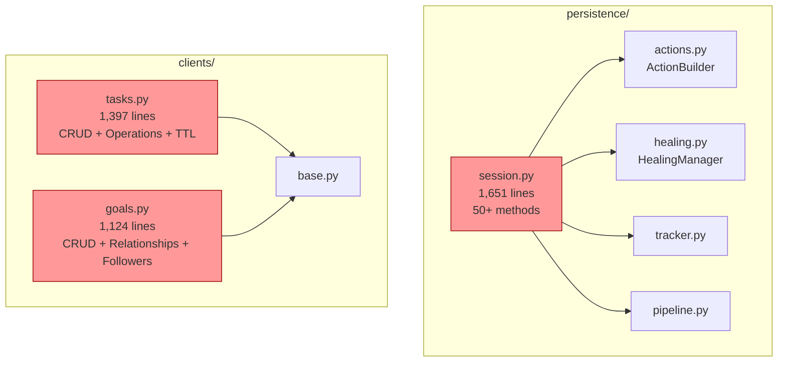
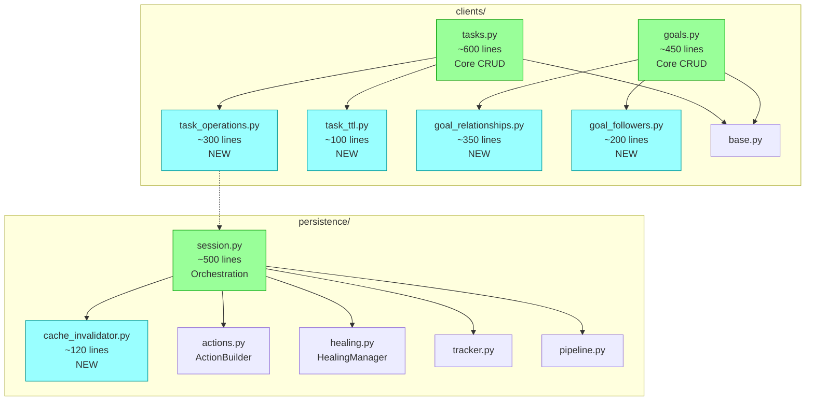

# TDD-13: SRP Decomposition for Core Modules

> Technical Design Document for decomposing session.py, tasks.py, and goals.py per Single Responsibility Principle.

## Metadata

| Field | Value |
|-------|-------|
| **Status** | Proposed |
| **Date** | 2025-12-28 |
| **Sprint** | SRP Decomposition |
| **Related ADRs** | ADR-0059, ADR-0045 |
| **Debt IDs** | DEBT-018, DEBT-019, DEBT-060 |
| **Complexity Level** | COMPONENT |

---

## Overview

This TDD specifies the component extraction strategy for three oversized modules:

| Module | Current | Target | Extraction Strategy |
|--------|---------|--------|---------------------|
| `persistence/session.py` | 1,651 lines | <500 | Extract cache invalidation |
| `clients/tasks.py` | 1,397 lines | <400 | Extract operations + TTL |
| `clients/goals.py` | 1,124 lines | <400 | Extract relationships + followers |

### Design Principles

1. **Single Responsibility**: Each extracted module has ONE clear purpose
2. **Interface Segregation**: Narrow, focused interfaces for extracted components
3. **Dependency Inversion**: Abstractions over concretions via Protocol definitions
4. **Zero Breaking Changes**: All `__all__` exports and public APIs preserved
5. **Thread Safety**: RLock patterns preserved in session.py extractions

---

## Architecture Overview

### Current Structure (Before)

```
autom8_asana/
  clients/
    tasks.py          # 1,397 lines - CRUD + operations + TTL
    goals.py          # 1,124 lines - CRUD + relationships + followers
    base.py           # Base client (unchanged)
  persistence/
    session.py        # 1,651 lines - Orchestration + cache invalidation
    actions.py        # ActionBuilder (from ADR-0045)
    healing.py        # HealingManager (from ADR-0045)
    tracker.py        # ChangeTracker
    pipeline.py       # SavePipeline
    models.py         # Data models
```

### Proposed Structure (After)

```
autom8_asana/
  clients/
    tasks.py              # ~600 lines - Core CRUD only
    task_operations.py    # ~300 lines - NEW: P1 convenience methods
    task_ttl.py           # ~100 lines - NEW: TTL resolution
    goals.py              # ~450 lines - Core CRUD only
    goal_relationships.py # ~350 lines - NEW: Subgoals + supporting work
    goal_followers.py     # ~200 lines - NEW: Follower management
    base.py               # Unchanged
  persistence/
    session.py            # ~500 lines - Orchestration only
    cache_invalidator.py  # ~120 lines - NEW: Cache coordination
    actions.py            # Unchanged
    healing.py            # Unchanged
    tracker.py            # Unchanged
    pipeline.py           # Unchanged
    models.py             # Unchanged
```

---

## Component Diagrams

### Before Decomposition



### After Decomposition



---

## Component Specifications

### 1. CacheInvalidator (NEW)

**Location**: `persistence/cache_invalidator.py`

**Purpose**: Coordinates cache invalidation after SaveSession commits.

**Responsibility**: Single - Cache entry invalidation for committed entities.

#### Interface Contract

```python
from typing import Any, Protocol
from autom8_asana.persistence.models import SaveResult, ActionResult


class CacheInvalidatorProtocol(Protocol):
    """Protocol for cache invalidation coordinators."""

    async def invalidate_for_commit(
        self,
        crud_result: SaveResult,
        action_results: list[ActionResult],
        gid_to_entity_lookup: dict[str, Any],
    ) -> None:
        """Invalidate cache entries affected by commit.

        Args:
            crud_result: Result of CRUD operations with succeeded entities.
            action_results: Results of action operations.
            gid_to_entity_lookup: Map of GID -> entity for membership lookup.
        """
        ...


class CacheInvalidator:
    """Coordinates cache invalidation after SaveSession commits.

    Per FR-INVALIDATE-001 through FR-INVALIDATE-006.
    Handles TASK, SUBTASKS, DETECTION, and DataFrame cache entries.

    Thread Safety: Stateless - safe for concurrent use.
    """

    def __init__(
        self,
        cache_provider: Any,
        log: Any | None = None,
    ) -> None:
        """Initialize invalidator with cache provider.

        Args:
            cache_provider: Cache implementation with invalidate() method.
            log: Optional structured logger.
        """
        self._cache = cache_provider
        self._log = log

    async def invalidate_for_commit(
        self,
        crud_result: SaveResult,
        action_results: list[ActionResult],
        gid_to_entity_lookup: dict[str, Any],
    ) -> None:
        """Invalidate all cache entries affected by commit.

        Implementation:
        1. Collect GIDs from succeeded CRUD operations
        2. Collect GIDs from successful action operations
        3. Invalidate TASK, SUBTASKS, DETECTION entries
        4. Invalidate DataFrame caches via membership lookup

        Failure Handling:
        - Individual invalidation failures logged but don't fail commit
        - Per NFR-DEGRADE-001: Graceful degradation
        """
        if self._cache is None:
            return

        gids = self._collect_affected_gids(crud_result, action_results)
        await self._invalidate_entity_caches(gids)
        await self._invalidate_dataframe_caches(gids, gid_to_entity_lookup)

    def _collect_affected_gids(
        self,
        crud_result: SaveResult,
        action_results: list[ActionResult],
    ) -> set[str]:
        """Collect GIDs of entities requiring cache invalidation.

        Sources:
        1. CRUD succeeded entities (CREATE/UPDATE/DELETE)
        2. Action operation task GIDs (where action.success)
        """
        gids: set[str] = set()

        # CRUD operations
        for entity in crud_result.succeeded:
            if hasattr(entity, "gid") and entity.gid:
                gids.add(entity.gid)

        # Action operations
        for action_result in action_results:
            if action_result.success and action_result.action.task:
                task = action_result.action.task
                if hasattr(task, "gid") and task.gid:
                    gids.add(task.gid)

        return gids

    async def _invalidate_entity_caches(self, gids: set[str]) -> None:
        """Invalidate TASK, SUBTASKS, DETECTION cache entries."""
        from autom8_asana.cache.entry import EntryType

        for gid in gids:
            try:
                self._cache.invalidate(
                    gid,
                    [EntryType.TASK, EntryType.SUBTASKS, EntryType.DETECTION],
                )
            except Exception as exc:
                if self._log:
                    self._log.warning(
                        "cache_invalidation_failed",
                        gid=gid,
                        error=str(exc),
                    )

    async def _invalidate_dataframe_caches(
        self,
        gids: set[str],
        gid_to_entity: dict[str, Any],
    ) -> None:
        """Invalidate DataFrame caches for project contexts."""
        from autom8_asana.cache.dataframes import invalidate_task_dataframes

        for gid in gids:
            entity = gid_to_entity.get(gid)
            if entity and hasattr(entity, "memberships") and entity.memberships:
                try:
                    project_gids = [
                        m.get("project", {}).get("gid")
                        for m in entity.memberships
                        if isinstance(m, dict) and m.get("project", {}).get("gid")
                    ]
                    if project_gids:
                        invalidate_task_dataframes(gid, project_gids, self._cache)
                except Exception as exc:
                    if self._log:
                        self._log.warning(
                            "dataframe_cache_invalidation_failed",
                            gid=gid,
                            error=str(exc),
                        )
```

#### Integration with SaveSession

```python
# In session.py commit_async()

# Phase 1.5: Cache invalidation (delegated)
if self._cache_invalidator:
    gid_to_entity = self._build_gid_lookup(crud_result, action_results)
    await self._cache_invalidator.invalidate_for_commit(
        crud_result,
        action_results,
        gid_to_entity,
    )
```

**Estimated Lines**: ~120

---

### 2. TaskOperations (NEW)

**Location**: `clients/task_operations.py`

**Purpose**: P1 convenience methods that wrap SaveSession for single-action operations.

**Responsibility**: Single - Convenience wrappers for common task mutations.

#### Interface Contract

```python
from typing import TYPE_CHECKING

from autom8_asana.models import Task
from autom8_asana.observability import error_handler
from autom8_asana.transport.sync import sync_wrapper

if TYPE_CHECKING:
    from autom8_asana.clients.tasks import TasksClient


class TaskOperations:
    """P1 convenience methods for common task operations.

    Wraps SaveSession internally for single-action operations.
    Per TDD-SDKUX Section 2C.

    Thread Safety: Stateless - safe for concurrent use.
    """

    def __init__(self, tasks_client: "TasksClient") -> None:
        """Initialize with parent TasksClient.

        Args:
            tasks_client: Parent client providing HTTP and client references.
        """
        self._client = tasks_client._client
        self._tasks = tasks_client

    # --- Tag Operations ---

    @error_handler
    async def add_tag_async(
        self,
        task_gid: str,
        tag_gid: str,
        *,
        refresh: bool = False,
    ) -> Task:
        """Add tag to task without explicit SaveSession.

        Args:
            task_gid: Target task GID.
            tag_gid: Tag GID to add.
            refresh: If True, fetch fresh task state after commit.

        Returns:
            Task object (refreshed if refresh=True).

        Raises:
            ValidationError: If GIDs invalid.
            SaveSessionError: If action fails.
        """
        from autom8_asana.persistence.exceptions import SaveSessionError
        from autom8_asana.persistence.session import SaveSession
        from autom8_asana.persistence.validation import validate_gid

        validate_gid(task_gid, "task_gid")
        validate_gid(tag_gid, "tag_gid")

        async with SaveSession(self._client) as session:
            task = await self._tasks.get_async(task_gid)
            session.add_tag(task, tag_gid)
            result = await session.commit_async()

            if not result.success:
                raise SaveSessionError(result)

        if refresh:
            return await self._tasks.get_async(task_gid)
        return task

    def add_tag(
        self,
        task_gid: str,
        tag_gid: str,
        *,
        refresh: bool = False,
    ) -> Task:
        """Add tag to task (sync)."""
        return self._add_tag_sync(task_gid, tag_gid, refresh=refresh)

    @sync_wrapper("add_tag_async")
    async def _add_tag_sync(
        self,
        task_gid: str,
        tag_gid: str,
        *,
        refresh: bool = False,
    ) -> Task:
        return await self.add_tag_async(task_gid, tag_gid, refresh=refresh)

    # --- Similar patterns for: ---
    # remove_tag_async / remove_tag
    # move_to_section_async / move_to_section
    # set_assignee_async / set_assignee
    # add_to_project_async / add_to_project
    # remove_from_project_async / remove_from_project
```

#### Method List

| Method | Lines (async+sync+wrapper) | Description |
|--------|---------------------------|-------------|
| `add_tag_async` / `add_tag` | ~40 | Add tag to task |
| `remove_tag_async` / `remove_tag` | ~40 | Remove tag from task |
| `move_to_section_async` / `move_to_section` | ~50 | Move task to section |
| `set_assignee_async` / `set_assignee` | ~30 | Set task assignee (HTTP direct) |
| `add_to_project_async` / `add_to_project` | ~45 | Add task to project |
| `remove_from_project_async` / `remove_from_project` | ~40 | Remove task from project |

**Estimated Lines**: ~300

---

### 3. TaskTTLResolver (NEW)

**Location**: `clients/task_ttl.py`

**Purpose**: Resolves cache TTL based on entity type detection.

**Responsibility**: Single - TTL calculation for task cache entries.

#### Interface Contract

```python
from typing import Any, Protocol


class TTLResolverProtocol(Protocol):
    """Protocol for TTL resolution strategies."""

    def resolve(self, data: dict[str, Any]) -> int:
        """Resolve TTL for given entity data.

        Args:
            data: Entity data dict from API.

        Returns:
            TTL in seconds.
        """
        ...


class TaskTTLResolver:
    """Resolves cache TTL based on entity type detection.

    Per FR-TTL-001 through FR-TTL-007.

    Priority:
    1. CacheConfig.get_entity_ttl() if available
    2. Detection-based defaults
    3. 300s default for unknown types

    TTL Values:
    - Business: 3600s (1 hour)
    - Contact/Unit: 900s (15 minutes)
    - Offer: 180s (3 minutes)
    - Process: 60s (1 minute)
    - Generic: 300s (5 minutes)
    """

    def __init__(self, config: Any) -> None:
        """Initialize with SDK configuration.

        Args:
            config: SDK configuration with optional cache settings.
        """
        self._config = config

    def resolve(self, data: dict[str, Any]) -> int:
        """Resolve TTL based on entity type detection.

        Args:
            data: Task data dict from API.

        Returns:
            TTL in seconds.
        """
        entity_type = self._detect_entity_type(data)

        # Priority 1: CacheConfig
        if hasattr(self._config, "cache") and self._config.cache is not None:
            cache_config = self._config.cache
            if hasattr(cache_config, "get_entity_ttl"):
                if entity_type:
                    return cache_config.get_entity_ttl(entity_type)
                if hasattr(cache_config, "ttl") and cache_config._ttl is not None:
                    return cache_config.ttl.default_ttl
                return 300

        # Priority 2: Canonical defaults
        from autom8_asana.config import DEFAULT_ENTITY_TTLS, DEFAULT_TTL

        if entity_type and entity_type.lower() in DEFAULT_ENTITY_TTLS:
            return DEFAULT_ENTITY_TTLS[entity_type.lower()]

        return DEFAULT_TTL

    def _detect_entity_type(self, data: dict[str, Any]) -> str | None:
        """Detect entity type from task data.

        Uses detection infrastructure for Business/Contact/Unit/Offer/Process.
        """
        try:
            from autom8_asana.models.business.detection import detect_entity_type
            from autom8_asana.models import Task

            temp_task = Task.model_validate(data)
            result = detect_entity_type(temp_task)
            if result and result.entity_type:
                return result.entity_type.value
            return None
        except Exception:
            return None
```

**Estimated Lines**: ~100

---

### 4. GoalRelationships (NEW)

**Location**: `clients/goal_relationships.py`

**Purpose**: Manages goal hierarchies and supporting work relationships.

**Responsibility**: Single - Goal relationship management (subgoals, supporting work).

#### Interface Contract

```python
from typing import Any, Literal, TYPE_CHECKING, overload

from autom8_asana.models import PageIterator
from autom8_asana.models.goal import Goal
from autom8_asana.transport.sync import sync_wrapper

if TYPE_CHECKING:
    from autom8_asana.clients.goals import GoalsClient


class GoalRelationships:
    """Manages goal hierarchies and supporting work relationships.

    Handles subgoals, supporting work (projects/portfolios), and positioning.

    Thread Safety: Stateless - delegates to HTTP client.
    """

    def __init__(self, goals_client: "GoalsClient") -> None:
        """Initialize with parent GoalsClient.

        Args:
            goals_client: Parent client providing HTTP access.
        """
        self._http = goals_client._http
        self._log_operation = goals_client._log_operation
        self._build_opt_fields = goals_client._build_opt_fields

    # --- Subgoal Operations ---

    def list_subgoals_async(
        self,
        goal_gid: str,
        *,
        opt_fields: list[str] | None = None,
        limit: int = 100,
    ) -> PageIterator[Goal]:
        """List subgoals of a goal.

        Args:
            goal_gid: Parent goal GID.
            opt_fields: Fields to include.
            limit: Items per page.

        Returns:
            PageIterator[Goal]
        """
        self._log_operation("list_subgoals_async", goal_gid)

        async def fetch_page(offset: str | None) -> tuple[list[Goal], str | None]:
            params = self._build_opt_fields(opt_fields)
            params["limit"] = min(limit, 100)
            if offset:
                params["offset"] = offset

            data, next_offset = await self._http.get_paginated(
                f"/goals/{goal_gid}/subgoals", params=params
            )
            goals = [Goal.model_validate(g) for g in data]
            return goals, next_offset

        return PageIterator(fetch_page, page_size=min(limit, 100))

    @overload
    async def add_subgoal_async(
        self,
        goal_gid: str,
        *,
        subgoal: str,
        raw: Literal[False] = ...,
        insert_before: str | None = ...,
        insert_after: str | None = ...,
    ) -> Goal: ...

    @overload
    async def add_subgoal_async(
        self,
        goal_gid: str,
        *,
        subgoal: str,
        raw: Literal[True],
        insert_before: str | None = ...,
        insert_after: str | None = ...,
    ) -> dict[str, Any]: ...

    async def add_subgoal_async(
        self,
        goal_gid: str,
        *,
        subgoal: str,
        raw: bool = False,
        insert_before: str | None = None,
        insert_after: str | None = None,
    ) -> Goal | dict[str, Any]:
        """Add a subgoal to a goal."""
        self._log_operation("add_subgoal_async", goal_gid)

        data: dict[str, Any] = {"subgoal": subgoal}
        if insert_before is not None:
            data["insert_before"] = insert_before
        if insert_after is not None:
            data["insert_after"] = insert_after

        result = await self._http.post(
            f"/goals/{goal_gid}/addSubgoal", json={"data": data}
        )
        if raw:
            return result
        return Goal.model_validate(result)

    # Sync wrapper
    def add_subgoal(self, goal_gid: str, *, subgoal: str, **kwargs) -> Goal | dict:
        return self._add_subgoal_sync(goal_gid, subgoal=subgoal, **kwargs)

    @sync_wrapper("add_subgoal_async")
    async def _add_subgoal_sync(self, goal_gid: str, **kwargs) -> Goal | dict:
        return await self.add_subgoal_async(goal_gid, **kwargs)

    # --- Supporting Work Operations ---
    # add_supporting_work_async / add_supporting_work
    # remove_supporting_work_async / remove_supporting_work
    # (Similar patterns)
```

**Estimated Lines**: ~350

---

### 5. GoalFollowers (NEW)

**Location**: `clients/goal_followers.py`

**Purpose**: Manages goal follower relationships.

**Responsibility**: Single - Goal follower management.

#### Interface Contract

```python
from typing import Any, Literal, TYPE_CHECKING, overload

from autom8_asana.models.goal import Goal
from autom8_asana.transport.sync import sync_wrapper

if TYPE_CHECKING:
    from autom8_asana.clients.goals import GoalsClient


class GoalFollowers:
    """Manages goal follower relationships.

    Handles adding and removing followers from goals.

    Thread Safety: Stateless - delegates to HTTP client.
    """

    def __init__(self, goals_client: "GoalsClient") -> None:
        """Initialize with parent GoalsClient.

        Args:
            goals_client: Parent client providing HTTP access.
        """
        self._http = goals_client._http
        self._log_operation = goals_client._log_operation

    @overload
    async def add_followers_async(
        self,
        goal_gid: str,
        *,
        followers: list[str],
        raw: Literal[False] = ...,
    ) -> Goal: ...

    @overload
    async def add_followers_async(
        self,
        goal_gid: str,
        *,
        followers: list[str],
        raw: Literal[True],
    ) -> dict[str, Any]: ...

    async def add_followers_async(
        self,
        goal_gid: str,
        *,
        followers: list[str],
        raw: bool = False,
    ) -> Goal | dict[str, Any]:
        """Add followers to a goal.

        Args:
            goal_gid: Goal GID.
            followers: List of user GIDs.
            raw: If True, return raw dict.

        Returns:
            Updated goal.
        """
        self._log_operation("add_followers_async", goal_gid)
        result = await self._http.post(
            f"/goals/{goal_gid}/addFollowers",
            json={"data": {"followers": ",".join(followers)}},
        )
        if raw:
            return result
        return Goal.model_validate(result)

    def add_followers(
        self, goal_gid: str, *, followers: list[str], **kwargs
    ) -> Goal | dict:
        return self._add_followers_sync(goal_gid, followers=followers, **kwargs)

    @sync_wrapper("add_followers_async")
    async def _add_followers_sync(
        self, goal_gid: str, *, followers: list[str], **kwargs
    ) -> Goal | dict:
        return await self.add_followers_async(goal_gid, followers=followers, **kwargs)

    # remove_followers_async / remove_followers (similar pattern)
```

**Estimated Lines**: ~200

---

## Integration Patterns

### Delegation for Backward Compatibility

All extracted components use delegation to maintain API stability:

```python
# In clients/tasks.py

class TasksClient(BaseClient):
    def __init__(self, ...):
        super().__init__(...)
        # Lazy initialization to avoid circular imports
        self._operations: TaskOperations | None = None
        self._ttl_resolver: TaskTTLResolver | None = None

    @property
    def operations(self) -> TaskOperations:
        """Access task operations helper."""
        if self._operations is None:
            from autom8_asana.clients.task_operations import TaskOperations
            self._operations = TaskOperations(self)
        return self._operations

    @property
    def ttl_resolver(self) -> TaskTTLResolver:
        """Access TTL resolver."""
        if self._ttl_resolver is None:
            from autom8_asana.clients.task_ttl import TaskTTLResolver
            self._ttl_resolver = TaskTTLResolver(self._config)
        return self._ttl_resolver

    # Delegation methods for backward compatibility
    async def add_tag_async(self, task_gid: str, tag_gid: str, **kwargs) -> Task:
        """Add tag to task (delegates to TaskOperations)."""
        return await self.operations.add_tag_async(task_gid, tag_gid, **kwargs)

    def add_tag(self, task_gid: str, tag_gid: str, **kwargs) -> Task:
        """Add tag to task (sync, delegates to TaskOperations)."""
        return self.operations.add_tag(task_gid, tag_gid, **kwargs)

    def _resolve_entity_ttl(self, data: dict[str, Any]) -> int:
        """Resolve TTL (delegates to TaskTTLResolver)."""
        return self.ttl_resolver.resolve(data)
```

### Circular Import Prevention

Extracted modules use TYPE_CHECKING imports:

```python
from typing import TYPE_CHECKING

if TYPE_CHECKING:
    from autom8_asana.clients.tasks import TasksClient


class TaskOperations:
    def __init__(self, tasks_client: "TasksClient") -> None:
        self._client = tasks_client._client
```

---

## Implementation Phases

### Phase 1: CacheInvalidator Extraction (session.py)

**Scope**: Extract `_invalidate_cache_for_results` to dedicated module.

**Steps**:
1. Create `persistence/cache_invalidator.py`
2. Move cache invalidation logic
3. Update `session.py` to delegate
4. Run persistence tests

**Risk**: Low - Self-contained logic, no RLock dependencies.

**Line Impact**: session.py 1,651 -> ~1,550

### Phase 2: TaskOperations Extraction (tasks.py)

**Scope**: Extract P1 convenience methods.

**Steps**:
1. Create `clients/task_operations.py`
2. Move add_tag, remove_tag, etc.
3. Add delegation methods to TasksClient
4. Run task client tests

**Risk**: Medium - SaveSession import in new module.

**Line Impact**: tasks.py 1,397 -> ~900

### Phase 3: TaskTTLResolver Extraction (tasks.py)

**Scope**: Extract TTL resolution logic.

**Steps**:
1. Create `clients/task_ttl.py`
2. Move `_resolve_entity_ttl` and `_detect_entity_type`
3. Delegate from TasksClient
4. Run cache-related tests

**Risk**: Low - Pure computation, no I/O.

**Line Impact**: tasks.py ~900 -> ~600

### Phase 4: GoalRelationships Extraction (goals.py)

**Scope**: Extract subgoal and supporting work operations.

**Steps**:
1. Create `clients/goal_relationships.py`
2. Move subgoal operations
3. Move supporting work operations
4. Add delegation methods to GoalsClient
5. Run goal client tests

**Risk**: Low - HTTP operations only.

**Line Impact**: goals.py 1,124 -> ~700

### Phase 5: GoalFollowers Extraction (goals.py)

**Scope**: Extract follower management.

**Steps**:
1. Create `clients/goal_followers.py`
2. Move add_followers, remove_followers
3. Add delegation methods to GoalsClient
4. Run goal follower tests

**Risk**: Low - HTTP operations only.

**Line Impact**: goals.py ~700 -> ~450

---

## Test Strategy

### Unit Test Coverage

Each extracted module requires dedicated tests:

| Module | Test File | Key Test Cases |
|--------|-----------|----------------|
| `cache_invalidator.py` | `test_cache_invalidator.py` | GID collection, entry invalidation, DataFrame invalidation, failure handling |
| `task_operations.py` | `test_task_operations.py` | Each operation, validation, error handling, refresh behavior |
| `task_ttl.py` | `test_task_ttl.py` | Entity detection, TTL resolution, config priority |
| `goal_relationships.py` | `test_goal_relationships.py` | Subgoal CRUD, supporting work, pagination |
| `goal_followers.py` | `test_goal_followers.py` | Add/remove followers, sync wrappers |

### Integration Test Strategy

Existing tests must pass unchanged:

```bash
# All 181 existing tests
pytest tests/ -v

# Specific module tests
pytest tests/unit/persistence/test_session*.py -v
pytest tests/unit/clients/test_tasks*.py -v
pytest tests/unit/clients/test_goals*.py -v
```

### Regression Prevention

CI pipeline gates:

1. **Line Count Check**: Primary files under targets
2. **Import Path Validation**: Public imports unchanged
3. **Test Coverage**: Maintain 90%+ coverage
4. **Type Check**: mypy passes

---

## Risk Assessment

| Risk | Likelihood | Impact | Mitigation |
|------|------------|--------|------------|
| Circular imports | Medium | High | TYPE_CHECKING imports, lazy initialization |
| Test failures from delegation | Low | Medium | Delegation methods preserve signatures exactly |
| Performance overhead from delegation | Low | Low | Single method call overhead (~1us) |
| Session thread safety broken | Low | High | CacheInvalidator is stateless, no RLock access |
| IDE autocomplete degradation | Low | Medium | Delegation methods on parent class visible |

---

## Success Criteria

| Metric | Target | Verification |
|--------|--------|--------------|
| session.py lines | <500 | `wc -l persistence/session.py` |
| tasks.py lines | <400 | `wc -l clients/tasks.py` |
| goals.py lines | <400 | `wc -l clients/goals.py` |
| Test pass rate | 100% | `pytest tests/` |
| Import compatibility | 100% | Python import validation |
| Extracted module coverage | >90% | `pytest --cov` |

---

## Cross-References

### Related ADRs

| ADR | Topic |
|-----|-------|
| ADR-0059 | SRP Decomposition Decision (this sprint) |
| ADR-0045 | SaveSession Decomposition (ActionBuilder precedent) |
| ADR-0040 | Unit of Work Pattern |
| ADR-0043 | Action Operations Architecture |

### Related TDDs

| TDD | Topic |
|-----|-------|
| TDD-04 | Batch & Save Operations |

### Debt Tickets

| Ticket | Description |
|--------|-------------|
| DEBT-018 | session.py exceeds 500-line target |
| DEBT-019 | tasks.py exceeds 400-line target |
| DEBT-060 | goals.py exceeds 400-line target |

---

## Revision History

| Version | Date | Author | Changes |
|---------|------|--------|---------|
| 1.0 | 2025-12-28 | Architect | Initial design |
