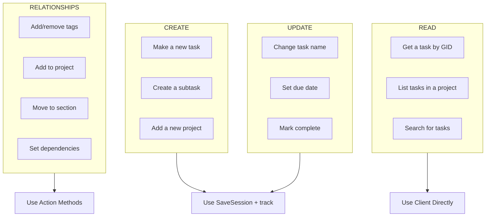
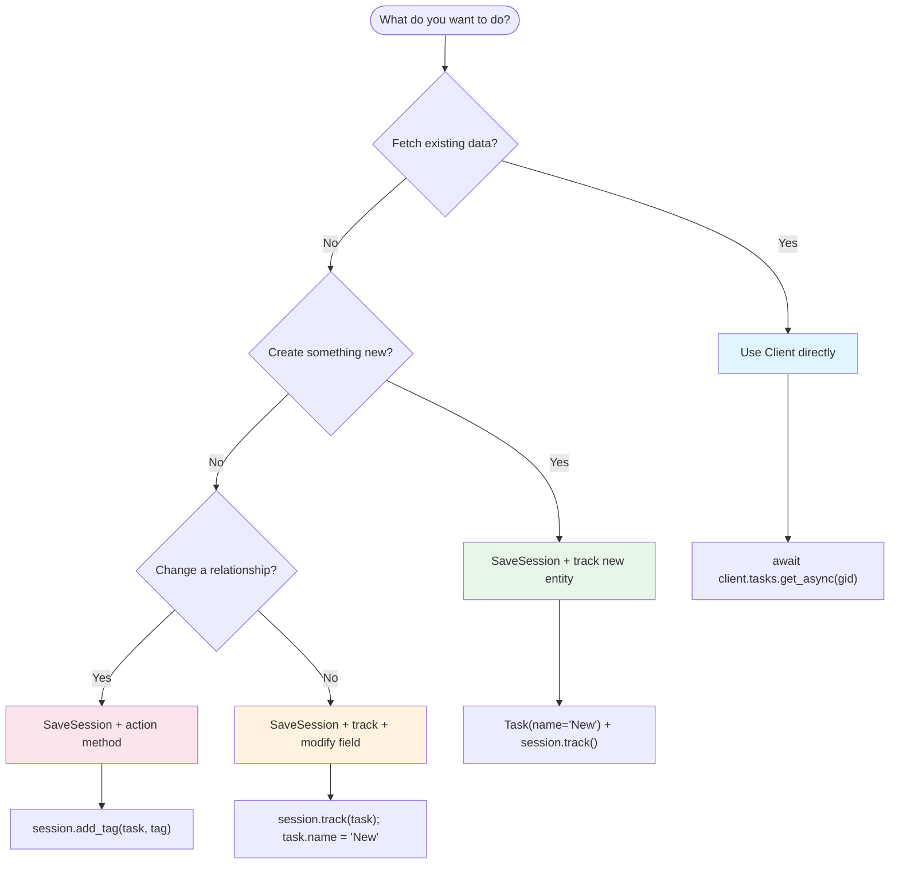

# Core Concepts

This guide explains the mental model behind the autom8_asana SDK. Read this first to understand *why* the SDK is designed the way it is.

---

## Why SaveSession?

When you interact with Asana, you often need to make multiple changes: update a task name, add a tag, move it to a section. Without the SDK, each change requires a separate API call.

**The problem with multiple API calls:**

1. **Slow**: 10 changes = 10 round trips to Asana's servers
2. **Fragile**: If call #7 fails, calls #1-6 already happened (no rollback)
3. **Complex**: Dependencies between changes require manual ordering (create parent before child)

**SaveSession solves all three:**

```python
async with SaveSession(client) as session:
    session.track(task)
    task.name = "Updated"           # Queued, not sent
    task.notes = "New notes"        # Queued
    session.add_tag(task, tag)      # Queued

    await session.commit_async()    # All changes sent in optimized batches
```

- **Batched**: Multiple field updates combined into single API calls
- **Ordered**: Parent entities saved before children automatically
- **Reported**: Partial failures return detailed results, not silent corruption

---

## The Four Operation Types

Every Asana SDK operation falls into one of four categories. Knowing which type you need determines which pattern to use.



| Type | What It Does | Pattern |
|------|-------------|---------|
| **READ** | Fetch data from Asana | `client.tasks.get_async()` |
| **CREATE** | Make new entities | `SaveSession` + `track()` |
| **UPDATE** | Modify existing fields | `SaveSession` + `track()` + direct assignment |
| **RELATIONSHIPS** | Change associations (tags, projects, dependencies) | `SaveSession` + action methods |

---

## Decision Tree

Use this to determine the right approach for your operation:



**When in doubt**: If your operation changes *associations between entities* (tags, projects, sections, dependencies, followers), use an action method. Everything else that modifies data goes through `track()` + direct assignment.

---

## Quick Examples

### READ: Fetch data from Asana

```python
from autom8_asana import AsanaClient

async with AsanaClient() as client:
    task = await client.tasks.get_async("task_gid")
    print(task.name)
```

### CREATE: Make a new task

```python
from autom8_asana import AsanaClient
from autom8_asana.persistence import SaveSession
from autom8_asana.models import Task

async with AsanaClient() as client:
    async with SaveSession(client) as session:
        new_task = Task(name="New Task")
        session.track(new_task)
        await session.commit_async()
        print(new_task.gid)  # Real GID after commit
```

### UPDATE: Modify existing fields

```python
async with AsanaClient() as client:
    task = await client.tasks.get_async("task_gid")

    async with SaveSession(client) as session:
        session.track(task)      # Must track BEFORE modifying
        task.name = "Updated"
        task.completed = True
        await session.commit_async()
```

### RELATIONSHIPS: Change associations

```python
async with AsanaClient() as client:
    task = await client.tasks.get_async("task_gid")

    async with SaveSession(client) as session:
        session.add_tag(task, "tag_gid")
        session.add_to_project(task, "project_gid")
        session.move_to_section(task, "section_gid")
        await session.commit_async()
```

---

## Field Categories

Understanding which fields can be modified directly and which require action methods is essential.

### Direct Modification (UPDATE pattern)

These fields can be assigned directly after calling `track()`:

| Field | Type | Example |
|-------|------|---------|
| `name` | string | `task.name = "New name"` |
| `notes` | string | `task.notes = "Description"` |
| `html_notes` | string | `task.html_notes = "<body>Rich text</body>"` |
| `completed` | bool | `task.completed = True` |
| `due_on` | string | `task.due_on = "2024-12-31"` |
| `due_at` | string | `task.due_at = "2024-12-31T17:00:00Z"` |
| `start_on` | string | `task.start_on = "2024-12-01"` |
| `start_at` | string | `task.start_at = "2024-12-01T09:00:00Z"` |
| `assignee` | string/User | `task.assignee = "user_gid"` |
| `approval_status` | string | `task.approval_status = "approved"` |
| Custom fields | varies | `task.custom_fields["Priority"] = "High"` |

### Action Methods Required (RELATIONSHIPS pattern)

These fields cannot be modified directly. Attempting to do so raises `UnsupportedOperationError`:

| Field | Add Method | Remove Method |
|-------|-----------|---------------|
| `tags` | `session.add_tag(task, tag)` | `session.remove_tag(task, tag)` |
| `projects` | `session.add_to_project(task, project)` | `session.remove_from_project(task, project)` |
| `followers` | `session.add_follower(task, user)` | `session.remove_follower(task, user)` |
| `dependencies` | `session.add_dependency(task, other)` | `session.remove_dependency(task, other)` |
| Section placement | `session.move_to_section(task, section)` | - |
| Parent/subtask | `session.set_parent(task, parent)` | `session.set_parent(task, None)` |
| Comments | `session.add_comment(task, text)` | - |
| Likes | `session.add_like(task)` | `session.remove_like(task)` |

---

## Common Patterns Combined

Real-world operations often combine multiple types:

```python
from autom8_asana import AsanaClient
from autom8_asana.persistence import SaveSession
from autom8_asana.models import Task

async with AsanaClient() as client:
    # READ: Fetch existing resources
    project = await client.projects.get_async("project_gid")
    section = await client.sections.get_async("section_gid")
    tag = await client.tags.get_async("tag_gid")

    async with SaveSession(client) as session:
        # CREATE: Make a new task
        task = Task(name="New Feature", notes="Implementation details")
        session.track(task)

        # UPDATE: Set properties (via direct assignment)
        task.due_on = "2024-12-31"
        task.assignee = "user_gid"

        # RELATIONSHIPS: Add associations (via action methods)
        session.add_to_project(task, project)
        session.move_to_section(task, section)
        session.add_tag(task, tag)

        # Commit everything in one operation
        result = await session.commit_async()
```

---

## What's Next?

- **[Common Workflows](workflows.md)**: Copy-paste recipes for typical operations
- **[Save Session Guide](save-session.md)**: Deep dive into SaveSession features (event hooks, result handling, previewing changes)
- **[Best Practices](patterns.md)**: Recommended patterns and common mistakes to avoid
- **[SDK Adoption Guide](sdk-adoption.md)**: Migrating from other Asana libraries
